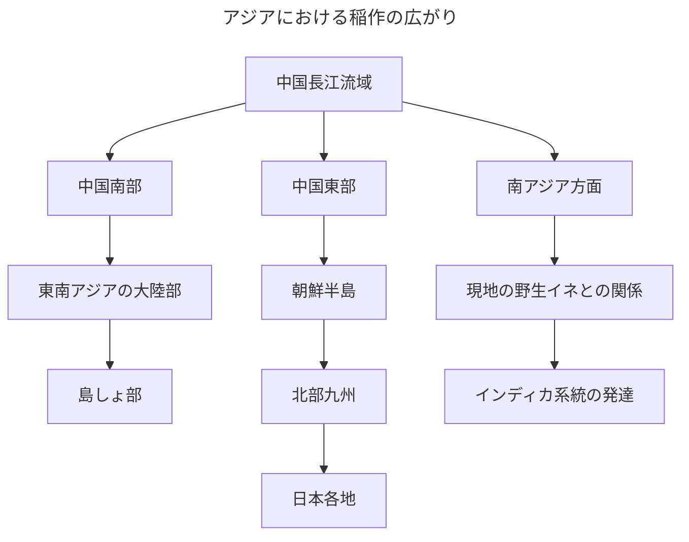
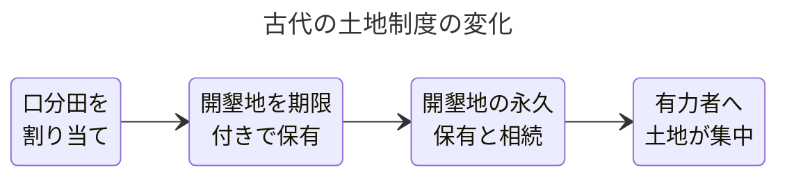

# 日本の米の歴史

## イネの起源と栽培化

日本の稲作の歴史を考えるには、まずイネが日本で生まれた作物ではないことを確認する必要がある。現在、世界で広く栽培されているアジア栽培イネは、アジア各地に自生していた野生イネを人間が長い時間をかけて選び、育てやすい作物へ変えてきたものである。

稲作の起源については、考古学や植物遺伝学による研究が続いており、細かな点では議論が残っている。ただし、ジャポニカ系統の栽培化が中国の長江流域を中心に進んだという考え方は、現在の有力な説明の1つである。長江下流域にある約9,000年前の遺跡では、人が野生イネを利用し、しだいに栽培化していったことを示す資料が見つかっている。

野生のイネは種子が熟すと穂から自然に落ちる性質を持っている。この性質は自然の中で子孫を広げるには便利であるが、人間が収穫するには不便である。そこで人々は、種子が落ちにくいイネを選んで栽培し、その種を翌年もまいたと考えられている。このような選択が何世代も続くことで、人間が収穫しやすい栽培イネが生まれた。

稲作はある日突然完成した技術として生まれたわけではない。初めの人々は、野生イネを採集しながら、湿地の植物を管理し、種をまき、育ちのよい株を選んだと考えられる。その後、水を管理する田んぼ、収穫に使う道具、米を保存する施設などが発達した。つまり、稲作の成立とは、植物の変化だけでなく、人間の生活技術が積み重なった結果である。

## アジアへ広がった稲作

長江流域で発達した稲作は、中国南部や東部へ広がり、さらに東南アジア、朝鮮半島、日本などへ伝わったと考えられている。また、南アジアでは、現地の野生イネとの交雑や栽培化が関係し、インディカ系統が成立したとする研究がある。

この広がりは、一本の道を同じ速さで進んだものではない。人々の移動、交易、婚姻、地域間の交流などを通じて、種もみと栽培技術が少しずつ運ばれた。地域によって気候や水の条件が異なるため、伝わったイネはその土地に合うように選ばれた。寒い地域では短い夏でも実る品種が必要になり、熱帯地域では高温や多雨に適した品種が選ばれた。

この図は、稲作の広がりを大まかに示したものである。実際の伝播には複数の経路があり、時代によって人や種の移動方向も異なったと考えられる。特にインディカ米の成立については、ジャポニカ系統から伝わった栽培化に関係する遺伝的性質と、南アジアの野生イネとの交雑を重視する考え方などがあり、研究が続いている。

稲作が広がるときには、米だけが移動したのではない。水田を作る技術、水路を管理する方法、石包丁などの収穫道具、穀物を保存する知識、米を蒸したり煮たりする調理法も伝わった。さらに、水田や水路で魚を育てる技術や、米を用いて魚を発酵させる食文化が一緒に広がった可能性も指摘されている。

## 日本への伝播経路

日本への水田稲作の伝播については、朝鮮半島を経由して北部九州へ伝わった経路が特に重視されている。大陸と北部九州の間には海があるが、朝鮮半島南部から対馬や壱岐を経由すれば、段階的に海を渡ることができる。北部九州では、縄文時代の終わりから弥生時代の初めにかけて、水田跡、農具、炭化米などが確認されている。

一方、中国大陸から東シナ海を渡って直接伝わった可能性や、中国南部から南西諸島を経由した可能性も論じられてきた。現在の研究では、すべてを1つの経路だけで説明するより、時期や地域によって複数の交流があったと考えるほうが自然である。

日本へ伝わったのは種もみだけではない。水田を区切る畦、水を引く水路、土を耕す農具、稲を刈る道具、収穫物を保存する高床倉庫などを含む、ひとまとまりの生産技術が伝わった。水田稲作を始めるには、土地を整えるだけでなく、村の人々が作業時期と水の利用方法を相談する必要がある。このため、稲作の伝来は食べ物の変化であると同時に、集落の運営方法の変化でもあった。

日本の気候も稲作の定着を助けた。日本列島の多くは、夏に気温が上がり、雨も比較的多い。山から流れる水を利用できる地域も多く、水田稲作に適していた。ただし、稲作はすぐに日本全国へ同じように広がったわけではない。寒冷な地域では栽培が難しく、東日本や東北地方への拡大には時間がかかった。

## 中国南部の米文化と北部の畑作文化

中国は国土が広く、南北で気候が大きく異なる。中国南部、特に長江流域より南の地域は、温暖で雨が多く、水田に水を供給しやすい。そのため、稲作が発達し、米や米を使った食品が食文化の中心になった。

これに対して中国北部は、南部より雨が少なく、冬の寒さも厳しい。黄河流域では、古くはアワやキビなどの雑穀が重要な作物であった。小麦は西方から伝わった後、しだいに北部の重要な作物となり、製粉や調理技術の発達とともに、麺、餃子、饅頭などの小麦食品が広がった。

したがって、中国の南北差を単純に、南は昔から米、北は昔から小麦とだけ説明するのは正確ではない。北部では小麦が広がる前からアワやキビの畑作文化が存在した。現在の米を主とする南部と、小麦食品を主とする北部という違いは、長い農業史と調理技術の変化によって形成されたものである。

この南北差には、降水量と気温だけでなく、水の利用方法も関係する。水田稲作では、田んぼへ水を引き、複数の農家が水路を共同で管理する必要がある。畑作では、雨水を利用して栽培できる地域も多い。この違いが、村の共同作業や暮らし方に影響を与えたと考える研究もある。ただし、人々の性格や文化を農作物だけで決めることはできない。農業は文化を形作る要因の1つであり、政治、交易、都市化、民族など多くの要因と合わせて考える必要がある。

現在の中国では、人の移動や食品流通が発達し、北部でも米が食べられ、南部でも麺や餃子が日常的に食べられている。そのため、南は米、北は小麦という区分は、地域の歴史的な傾向を示すものであり、現代の食生活を完全に分ける境界ではない。

## ジャポニカ米とインディカ米

アジア栽培イネは、大きく見るとジャポニカ系統とインディカ系統に分けられる。日本で一般に食べられている米の多くは、温帯ジャポニカに属する。粒は比較的短く丸みがあり、炊くと粘りが出やすい。箸で食べやすく、おにぎりやすしにも向いている。

インディカ米は、一般に細長い粒を持ち、炊いたときに粒が離れやすいものが多い。インド、パキスタン、バングラデシュ、タイ、ベトナムなど、南アジアや東南アジアの広い地域で栽培されている。カレー、炒飯、ビリヤニなど、米粒がほぐれる性質を生かした料理に適している。

ジャポニカには、日本や朝鮮半島、中国東北部などの比較的涼しい地域で栽培される温帯ジャポニカと、中国南部、東南アジアの山地、インドネシアなどでも見られる熱帯ジャポニカがある。つまり、ジャポニカ米は日本だけの米ではなく、アジアの複数地域に分布している。

また、世界の米をジャポニカとインディカの2つだけで完全に分類できるわけではない。香り米として知られるバスマティなどに関係するアウス系統、アフリカで独自に栽培化されたアフリカイネ、もち米など、さまざまな系統や性質を持つ多様な米が存在する。

この分布は、国境できれいにわかれているわけではない。1つの国で複数の系統が栽培されることも多い。中国では南部を中心にインディカ米が多く、東北部などではジャポニカ米が栽培されている。アメリカ合衆国でも、地域や用途に応じて長粒種と中短粒種が作られている。

## 稲作の始まり

日本で水田稲作が本格的に広まったのは、縄文時代の終わりから弥生時代にかけてとされている。稲作は大陸から伝わり、まず北部九州などで行われ、その後、日本各地へ広がっていったと考えられている。

稲を育てるためには、水を引く田んぼを整え、種をまき、苗を育て、収穫するまで多くの作業が必要になる。そのため、稲作は1人だけでは行いにくく、人々が協力して作業する必要があった。水路の管理や田植えの時期をそろえるために、村の中で話し合いや役割分担が行われたと考えられる。

このように、米作りは単なる食料生産ではなく、人々が集団で生活する仕組みにも影響を与えた。田んぼを中心に集落がつくられ、収穫した米を保存する倉庫も必要になった。米の量は、その集落がどれほど豊かであるかを示すものにもなった。

## 律令制度と口分田

古代の律令国家では、戸籍に登録された人々へ口分田を割り当てる班田収授法が行われた。口分田は、農民が自分や家族の食料を作り、生活を支えるための土地であった。ただし、完全な私有地ではなく、原則として本人が死亡すると国家へ返すことになっていた。

この制度は、国家が土地を無償で与えたというより、人々へ生活と生産の基盤を与える一方で、税や労役を負担させる仕組みであった。農民は口分田を耕して生活し、その面積に応じて租を納めた。

租という字には、もともと土地や物を利用する代わりに納めるものという意味がある。律令制度の租は、田の面積を基準に稲を納める税であった。現在の家賃と同じではないが、土地の利用と負担が結びついていた点では、土地を使う代わりに一定の負担を求める考え方に近い。

## 租庸調と古代の税

律令制度の税としてよく知られているのが、租、庸、調である。ただし、3つとも米を納める税ではなかった。

租は、口分田の面積に応じて稲を納める税であり、地方の倉庫に蓄えられた。庸は、都で一定期間働く労役の代わりに、布などを納める負担であった。調は、地方の特産物や布を納める税である。このほか、地方で土木工事などに従事する雑徭や、兵士として働く軍役などもあった。

つまり、古代の農民は米だけを納めていたのではない。米、布、特産物、労働力など、さまざまな形で国家を支えていた。米は重要な税であったが、律令国家の財政全体は複数の負担によって成り立っていた。

## 三世一身法と墾田永年私財法

人口が増えると、戸籍に登録された人々へ配る口分田が不足するようになった。また、新しい田を増やさなければ、国家が集められる租も増えない。そのため、律令国家は開墾を進める必要に迫られた。

723年に制定された三世一身法では、新しく用水路や池を造って開墾した土地は三世代まで、既存の用水を利用して開墾した土地は本人一代まで保有することが認められた。これは開墾した人に一定期間の利益を認めることで、新しい田を増やそうとする政策であった。

しかし、期限が来れば土地を国家へ返さなければならなかった。田を開くには、木を切り、土地をならし、水路を造り、その後も毎年管理する必要がある。大きな労力をかけても将来は返還しなければならないため、開墾や維持への意欲を十分に高められなかったと考えられている。

そこで743年、墾田永年私財法が制定された。新しく開墾した土地を期限なく保有し、子孫へ相続することが認められたのである。国家としては、開墾者に長期的な利益を与える代わりに、田と米の生産量を増やし、税収を確保しようとした。

三世一身法から20年後に政策が変更された理由を、当時の平均寿命と結びつける必要はない。三世一身法の一身は20年間という意味ではなく、本人が生きている期間を指す。政策変更の中心的な理由は、期限付きの権利では開墾と土地の維持を十分に進められなかったことにある。

墾田永年私財法は、唐の特定の法律をそのまま移したものではない。班田収授法など、日本の律令制度全体は唐の均田制を参考にしていたが、墾田永年私財法は、日本で起きた口分田不足や開墾停滞への対応として作られた政策である。

また、この法律は現在の土地私有制度の直接の起源ではない。しかし、国家が管理する土地とは別に、私人が開墾地を継続して保有し、相続できるようにした点で、土地私有化の重要な転換点となった。現在の近代的な土地所有制度に直接つながるのは、明治時代の地租改正や、その後の民法、不動産登記制度である。

一方、実際に大規模な開墾を行えたのは、労働力や資金を持つ貴族、寺社、地方の有力者であった。土地が有力者へ集まり、後の荘園形成につながったため、開墾を促す政策が公地公民の原則を弱める結果にもなった。

## 米と政治や税

古代から近世にかけて、米は食料であると同時に、税としても重要であった。農民が収穫した米の一部を税として納める制度がつくられ、支配者は集めた米を政治や軍事のために利用した。

江戸時代には、土地の生産力を石高で表した。1石は、おおよそ1人が1年間に食べる米の量をもとにした単位とされている。大名の力も石高で示されることが多く、米が経済力や政治力を表す基準になっていたことがわかる。

しかし、米が豊かさの基準であった一方で、農民の生活がいつも安定していたわけではない。天候不順や冷害、洪水、害虫などによって収穫量が減ると、飢きんが起こることもあった。米を中心とした社会は、米を収穫できない年に大きな影響を受ける社会でもあった。

## 太閤検地と石高制

戦国時代には、1つの土地に武士、寺社、村などの権利が重なり、誰が耕し、誰が年貢を負担するのかわかりにくい場合があった。豊臣秀吉が全国的に進めた太閤検地は、この複雑な土地関係を整理する政策であった。

検地では、田畑の面積、土地の等級、予想される収穫量、耕作者などを調べ、検地帳へ記録した。また、物差しや升の基準を統一し、地域によって異なっていた測り方をそろえた。

土地の生産力は、収穫できる米の量に換算した石高で示された。実際に米が作られていない土地でも、経済力を米の量に置き換えて評価する場合があった。米が土地と権力を測る共通の物差しになったのである。

太閤検地には、土地の権利と年貢負担をわかりやすくした面がある。一方で、耕作者と生産力を正確に把握し、年貢を確実に集めるための政策でもあった。公平な土地調査と徴税の強化という、2つの側面を持っていたといえる。

## 大正時代の米騒動

1918年、大正時代の日本で米騒動が起こった。第一次世界大戦中の物価上昇、都市人口の増加、米の需要拡大などを背景に、米価が急激に上昇した。さらに、米商人による買い占めや売り惜しみ、シベリア出兵を見越した投機への不満も高まった。

騒動の始まりとして知られているのは、富山県の沿岸部で起きた女性たちの行動である。米が県外へ運び出されるのを止めることや、安く販売することを求めた動きが新聞で報じられ、全国へ広がった。各地で米の安売り要求や商店への押しかけが起こり、一部では打ち壊しや放火も発生した。

米騒動は、単なる食料問題ではなく、政治を揺るがす社会問題になった。寺内正毅内閣は退陣し、その後、原敬を首相とする本格的な政党内閣が成立した。

この出来事は、米の価格が国民生活と政治の安定に直結することを示している。ただし、現在の米価上昇と1918年を同じものとして扱うことはできない。当時は米が家計と食生活に占める割合が現在より大きく、社会保障や流通制度も十分ではなかったからである。

## 近代から現代への変化

明治時代以降、日本では農業技術の改良が進み、品種の選び方や肥料の使い方、農具なども少しずつ変化した。さらに、戦後になると農地改革が行われ、自分の土地を持つ農家が増えた。

その後、農業機械の普及によって、田植えや稲刈りに必要な労力は大きく減った。以前は多くの人が何日もかけて行っていた作業を、機械で効率よく進められるようになったのである。

一方で、日本人の食生活は大きく変化した。肉類、乳製品、パン、麺類などを食べる機会が増え、主食の選択肢も広がった。その結果、米は今も重要な主食であるが、以前のように食生活の中心を占める存在ではなくなった。

## 米余りと減反政策

戦後しばらくの日本では、食料不足を解消するため、米を多く生産することが重要な目標であった。品種改良、肥料の利用、農業機械の普及などによって生産量が増え、米不足はしだいに解消された。

ところが、食生活の変化によって米の消費量が減ると、今度は生産量が需要を上回る米余りが問題になった。米が余れば価格が大きく下がり、農家の経営が不安定になる可能性がある。また、政府が余った米を買い入れて保管する場合には、多額の費用も必要になる。

そこで、1970年代から本格的に行われたのが、一般に減反政策と呼ばれる生産調整である。これは、田んぼを単に放置する政策ではない。主食用米の作付面積を減らし、麦、大豆、飼料用米など、別の作物へ転換することで、米の供給量を需要に近づけ、価格の急落を防ぐことが主な目的であった。

しかし、生産調整が長く続いたことで、農家が需要の変化に合わせて自由に増産しにくいという批判も生まれた。また、水田を維持しながら別の作物を作るには、補助金が必要になる場合があり、制度が複雑になった。

2018年産からは、国が都道府県などに主食用米の生産数量目標を直接配分する方法が廃止された。その後は、産地や農家が需要や価格の情報を見ながら、どの作物をどれだけ作るかを判断する仕組みに変わっている。

ただし、これによって生産調整そのものが完全になくなったわけではない。現在も、麦、大豆、飼料用米、米粉用米などへの転換を支援する制度があり、主食用米が作られすぎないようにする働きを持っている。つまり、国が数量を直接割り当てる仕組みから、補助金や情報提供を通じて需要に合った生産を促す仕組みへ変化したのである。

減反政策の結果、米の大幅な余剰を抑え、価格を支える役割は果たしたと考えられる。一方で、生産量をすぐに増やしにくい体質や、補助金に左右されやすい作付け判断を残したという見方もある。米が不足したと感じられる時期には、長年続いた生産調整との関係が改めて議論されることになる。
