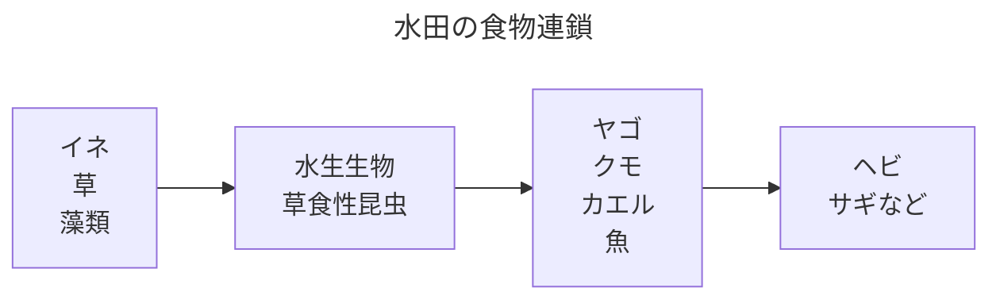

# 日本の米作り

## 米ができるまで

米作りは、春から秋まで長い時間をかけて行われる。まず、春になると種もみを選び、発芽させて苗を育てる。田んぼでは土を耕し、水を入れ、土を細かくして田植えの準備をする。この作業を代かきという。

苗が十分に育つと、田植えを行う。現在では田植え機を使う農家が多いが、場所によっては手作業で植えることもある。田植えの後は、水の量を調整しながら稲を育てる。水が多すぎても少なすぎてもよくないため、田んぼの状態をこまめに確認する必要がある。

夏になると、雑草や害虫、病気への対策が必要になる。稲は成長すると穂を出し、花を咲かせる。その後、穂の中に米が実っていく。秋になると稲が黄金色に変わり、収穫の時期を迎える。

収穫した稲は乾燥させ、脱穀によって稲からもみを外す。次に、籾すりによってもみ殻を取り除き、玄米にする。玄米を精米すると、一般に食べられている白米になる。店頭に並ぶ白米は、田んぼからそのまま茶わんに移動してきたわけではなく、多くの工程を経ている。

## 農業機械と生産性の向上

現在の米作りでは、トラクター、田植え機、コンバインなどの農業機械が重要な役割を持っている。これらの機械は、単に作業を楽にしただけでなく、少ない人数で広い田んぼを管理できるようにし、米作りの生産性を大きく高めた。

トラクターは、田んぼを耕す田起こしや、土と水を混ぜて平らにする代かきに使われる。人や牛が農具を引いていた時代と比べると、短い時間で深く均一に耕すことができる。田植え機は、一定の間隔と深さで苗を植えるため、手作業より速く、作業のばらつきも小さくなる。

コンバインは、稲を刈り取り、穂からもみを外す脱穀までを1台で行う機械である。以前は、稲刈り、稲の運搬、乾燥、脱穀を別々に行う必要があった。コンバインの普及によって、収穫期の作業時間は大幅に短くなった。雨が降る前に収穫を終えやすくなったことも大きな利点である。

農林水産省の資料によると、1960年頃の稲作では、10アール当たり約174時間の労働が必要であった。2021年には約21.1時間まで減少している。これはおよそ8分の1であり、圃場整備や栽培技術の改良とともに、農業機械の普及が大きく寄与した。

機械化によって、1戸の農家が管理できる田んぼの面積も広がった。高齢化や農業人口の減少が進む中で、少人数でも地域の水田を維持できるようになったことは重要である。

一方で、農業機械には高い購入費や維持費がかかる。小さな田んぼを少しだけ持つ農家では、機械を買っても十分に使い切れず、米の生産費が高くなる場合がある。そのため、複数の農家で機械を共同利用したり、農業法人が作業を引き受けたりする方法も広がっている。

最近では、自動運転トラクターや、収穫量を記録できるコンバインも利用され始めている。従来の機械化が人の力仕事を減らしたとすれば、現在のスマート農業は、運転や判断の一部まで機械やデータに任せようとする段階に進んでいる。

## 米作りと自然条件

米作りには、水、土、気温、日照時間などの自然条件が大きく関係する。特に水は重要であり、田んぼに安定して水を供給できるかどうかが収穫に影響する。

日本は雨が多く、川や山が多いため、水田稲作に向いた地域が多い。しかし、同じ日本でも地域によって気候は異なる。東北や北海道のように冬が寒い地域では、寒さに強く、短い夏でも育つ品種が必要になる。一方、西日本では暑さや台風への対策が重要になる。

近年では、夏の高温によって米の品質が下がることも問題になっている。気温が高すぎると、米が白く濁ったり、粒のそろいが悪くなったりすることがある。そのため、高温に強い品種の開発や、水の管理方法の工夫が進められている。

## 農薬による安定生産と水田の生物多様性

米作りでは、病気、害虫、雑草によって収量や品質が低下することがある。農薬は、これらの被害を抑え、安定して米を生産するために使われてきた。農薬の普及によって、農家は病害虫による大きな損失を避けやすくなり、除草作業の負担も軽くなった。

一方、農薬は目的とする害虫や雑草だけでなく、水田に生息するほかの生物へ影響を与える場合がある。特に、使用する種類、量、時期が適切でなければ、水生昆虫、クモ、魚、カエルなどが減少する可能性がある。

ただし、イナゴやトンボが農薬によって日本から消えたと断定することはできない。イナゴは現在も日本に生息しており、主にイネ科植物を食べる昆虫である。小さな生物を捕食する側ではない。トンボも現在まで生息しているが、地域によって種類や個体数が減少した例がある。

水田の生物減少には、農薬以外の要因も関係する。田んぼを乾かす期間の変化、水路のコンクリート化、水田と水路の分断、圃場の大型化、宅地化、耕作放棄などである。田んぼの生き物が減った原因を、農薬だけに求めることはできない。

水田には、植物や藻類を食べる小さな生物がいて、それを水生昆虫、トンボの幼虫、クモ、カエル、魚などが食べる。さらに、カエルや魚をヘビや鳥が食べる。水田は米を生産する場所であると同時に、多くの生物がつながる場所でもある。

農薬をまったく使わないことが、すべての地域で現実的とは限らない。病害虫が大発生すれば、収量が減り、農家の経営が不安定になる可能性がある。重要なのは、農薬を使うか使わないかの二択ではなく、必要性を判断しながら使用量を抑えることである。

その方法の1つが、IPM（Integrated Pest Management）である。日本語では総合的病害虫・雑草管理と呼ばれる。害虫の発生状況を観察し、農薬だけに頼らず、抵抗性品種、天敵、生育管理などを組み合わせ、必要な場合に適切な農薬を使う。

環境に配慮した米作りでは、水田と水路のつながりを保つこと、魚道を設けること、農薬の使用時期を工夫すること、田んぼの一部に生き物が逃げられる場所を残すことなども行われている。

ここで考えるべきなのは、農薬を悪いものとして完全に否定することではない。米の収量と品質を守りながら、水田の生物多様性も守る方法を探すことである。安定生産と環境保全の両立が、これからの米作りに求められている。

## 品種とブランド米

日本では多くの米の品種が作られている。よく知られている品種には、コシヒカリ、ひとめぼれ、あきたこまち、ななつぼし、つや姫などがある。

品種によって、粘り、甘み、香り、粒の大きさ、冷めたときのおいしさなどに違いがある。たとえば、粘りが強い米は白いご飯として食べやすく、冷めても味が落ちにくい米はおにぎりや弁当に向いている。

同じ品種でも、作られた地域や栽培方法によって味が異なることがある。そこで、産地名や独自の基準を組み合わせて販売するブランド米も増えている。生産者は味だけでなく、安全性や栽培方法、地域の特徴を伝えることで、ほかの米との差を示している。

ただし、名前が立派であれば必ず自分の好みに合うとは限らない。米にも相性があり、値段の高さだけで決めると、茶わんの中で少し気まずい再会をすることになる。
